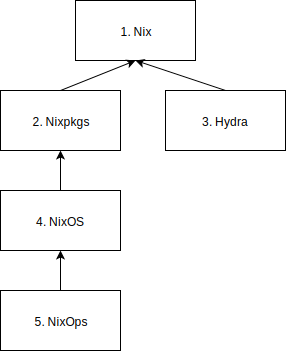
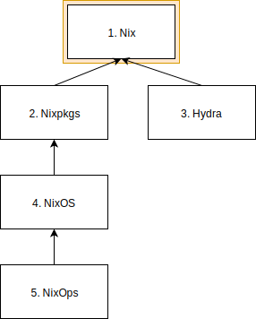
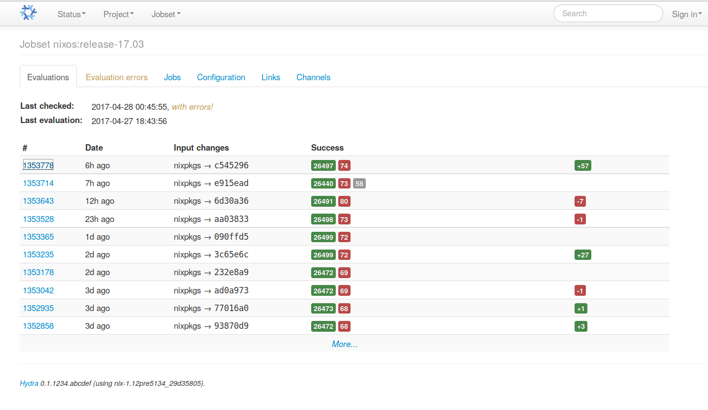

<!--
Multi-Monitor-Shortcuts:
Ctrl-O: Move Window to next screen
Mod4 + Control + j/k: Focus next/previous screen

reveal.js-Shortcuts:
o: Öffne Übersicht
s: Öffne Vortragsmonitor
-->

## Themenabend: NixOS 

**Slides:** https://github.com/Mic92/themenabend-nixos

28. April 2008

</img>

Note:
- Ich Nixpkgs maintainer


## Das Nixprojekt

- Nix: ein funktionaler Packetmanager und Buildsprache </img>
- Nixpkgs: Nix-Packetsammlung
- NixOS: eine Nix-basierte Linuxdistribution
- Hydra: ein Nix-basiertes verteiltes Buildsystem (CI)
- NixOps: Nixos-basiertes Deploymenttool

Note:
- Nix: Edolstra, 2006
- nixpkgs: ähnlich Ports


## Besonderheiten von Nix

- *generisch:* sprach- und technologieagnostisch
- *reproduzierbar:* Selbe Eingabe -> Selbe Ausgabe
- *verlässlich:* alle Abhängigkeiten vollständig, atomare Upgrades/Rollbacks
- *effizient:* Nur notwendig Upgradeschritte

Note:
- reproduzierbar: keine Wechselwirkungen zwischen Packeten
- atomare: altes bleibt erhalten
- effizient: beim Packetneubau und Upgrade


## NixOS - Konfiguration

```nix
# /etc/nixos/configuration.nix
{ pkgs, ... }:
{ 
  boot.loader.grub.device = "/dev/sda";
  fileSystems = [ { mountPoint = "/"; device = "/dev/sda2"; } ];
  swapDevices = [ { device = "/dev/sda1"; } ];
  services = {
    openssh.enable = true;
    xserver = {
      enable = true;
      desktopManager.kde4.enable = true;
    };
  };
  environment.systemPackages = [ pkgs.mc pkgs.firefox ];
}
```

Note:
- syntax highlighting! 
- Funktion (Nix expression language)


## NixOS - Konfiguration

```console
$  nixos-rebuild switch
```

1. Baut Konfiguration + startet/stoppt Dienste
2. Upgrades sind atomar
3. Nutzer kann zu alten Generationen zurück

Note:
- eine Möglichkeit upzudaten (setzt Bootloader)
- Packete + Konfiguration sind in Sync 
- garbage collection


## NixOS Grub

</img>


## Nix - der Packetmanager

</img>


## Nix - Funktionsweise

- Idee: Alle packages werden isoliert voneinander:
- `/nix/store/rpdqx...-firefox-3.5.4`
- Pfad enhält einen 160-bit kryptografischen Hash aller Packetabhängigkeiten:
  - Quellen, Bibliotheken, Kompiler, Buildskripte


## Nix - Funktionsweise
```
/nix/store 
|-- l9w6773m1msy...-openssh-4.6p1
|  |-- bin
|  |  |-- ssh
|  |-- sbin
|     |-- sshd
|-- smkabrbibqv7...-openssl-0.9.8e
|  |-- lib
|     |-- libssl.so.0.9.8
|-- c6jbqm2mc0a7...-zlib-1.2.3
|  |-- lib
|     |-- libz.so.1.2.3
|-- im276akmsrhv...-glibc-2.5
   |-- lib
      |-- libc.so.6
```


## Nix - Funktionsweise

Bei der Installation wird ein globale Profil mit Symlinks erstellt:

```console
$ which which
/run/current-system/sw/bin/which
$ readlink -f /run/current-system/sw/bin/which                                                              
/nix/store/fnrf1bns...-which-2.21/bin/which
$ ldd /run/current-system/sw/bin/which
linux-vdso.so.1
libc.so.6 => /nix/store/78w6a8zinhp...-glibc-2.25/lib/libc.so.6
/nix/store/78w6a8zin...-glibc-2.25/lib/ld-linux-x86-64.so.2
```


## Nix - Funktionsweise

Bei einem Update wird eine neue Generation erstellt,

```console
$ readlink /nix/*/profiles/system
system-417-link
$ readlink /nix/*/profiles/system-417-link/sw/bin/which
/nix/store/fnrf1bnsz3..-which-2.21/bin/which
$ readlink /nix/var/nix/profiles/per-user/joerg/profile
profile-139-link
```

ältere Generationen bleiben bis sie garbage collected werden erhalten:

```console
$ nix-collect-garbage
```


## Nix - Expressions

```nix
# openssh.nix
{ stdenv, fetchurl, openssl, zlib }:
stdenv.mkDerivation {
  name = "openssh-4.6p1";
  src = fetchurl {
    url = http://.../openssh-4.6p1.tar.gz;
    sha256 = "0fpjlr3bfind0y94bk442x2p...";
  };
  buildCommand = ''
    tar xjf $src
    ./configure --prefix=$out --with-openssl=${openssl}
    make
    make install
 '';
}
```

Note:
- automatisch runtime deps
- dev-output


## Nix - Expressions

```nix
# all-packages.nix

openssh = import ../tools/networking/openssh {
  inherit fetchurl stdenv openssl zlib;
};
openssl = import ../development/libraries/openssl {
  inherit fetchurl stdenv perl;
};
stdenv = ...;
openssl = ...;
zlib = ...;
perl = ...;
```

```
$ nix-env -f all-packages.nix -iA openssh
/nix/store/l9w6773m1msy...-openssh-4.6p1
```


## Hydra

</img>

Note:
- Reihenfolge wird erkannt
- weiß wann neugebaut werden muss (keine maintainer revisions)

<!-- wo eigenet sich NixOS, wo nicht. -->
